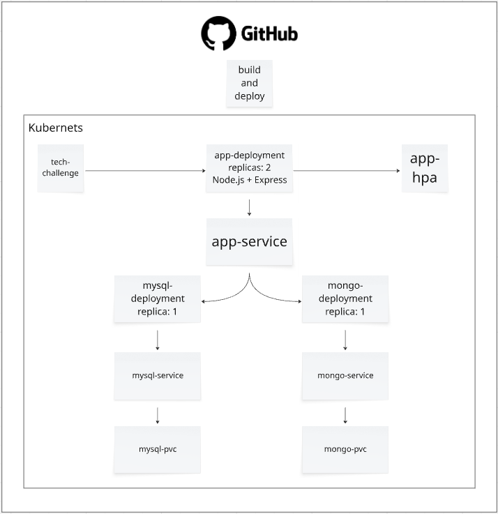

# 🛠️ Sistema de Ordem de Serviço e Controle de Estoque - Oficina Mecânica

## 📋 Descrição do Projeto
Este projeto é uma aplicação **backend** desenvolvida em **Node.js** para gerenciar **ordens de serviço** e **controle de estoque** em uma oficina mecânica.  
O sistema permite o registro de veículos, criação e gerenciamento de ordens de serviço (OS), atribuição de mecânicos, controle de orçamento, atualização de status e histórico de alterações.

### ⚙️ Principais Funcionalidades
- **Cadastro e gerenciamento de veículos**
- **Criação de ordens de serviço (OS)** com ou sem orçamento inicial
- **Atribuição de mecânicos** às ordens
- **Controle de estoque** de peças e materiais
- **Registro de histórico de alterações** de status (MongoDB)
- **Autenticação e autorização** com controle de permissões via *roles* (`admin`, `mechanic`)
- **Documentação automática da API** via Swagger

---

## 🧩 Arquitetura Geral
A aplicação foi desenvolvida em **Node.js** com banco de dados **MySQL** e **MongoDB**.  
Todo o ambiente é conteinerizado e pode ser executado localmente via **Docker Desktop com Kubernetes ativado**.

Infraestrutura e deploy são totalmente automatizados com:
- **Docker** e **Docker Compose**
- **Kubernetes**
- **Terraform**
- **GitHub Actions (CI/CD)**

---

## 🚀 Execução Local (Docker Compose)

### 🧱 Pré-requisitos
- [Docker Desktop](https://www.docker.com/products/docker-desktop) com **Kubernetes ativado**
- [Node.js](https://nodejs.org/) (para executar testes ou build local)
- [Git](https://git-scm.com/)

### 🧰 Passos
1. **Clone o repositório**
   ```bash
   git clone https://github.com/lufepedrosa/tech-challenge-fiap
   cd tech-challenge-fiap
   ```

2. **Suba os containers**
   ```bash
   docker compose up --build
   ```

3. **Acesse a aplicação**
   ```bash
   API: http://localhost:3000
   Documentação Swagger: http://localhost:3000/api
   ```   

## ☸️ Deploy em Kubernetes (Docker Desktop)  

### 📦 Estrutura Kubernetes
Os manifests YAML estão na pasta `k8s/`:
- `app-deployment.yaml`
- `app-service.yaml`
- `hpa.yaml`
- `configmap.yaml`
- `mysql-deployment.yaml / mysql-service.yaml`
- `mongo-deployment.yaml / mongo-service.yaml`

### 🧭 Passos para Deploy Manual
1. **Verifique se o Kubernetes está ativo no Docker Desktop**
   ```bash
   kubectl config current-context
   ```

2. **Criar a imagem `lastest`**   
   ```bash
   docker build -t app:latest .
   ```  

3. **Aplique os manifests**
   ```bash
   kubectl apply -f k8s/
   ```   

4. **Verifique os pods e serviços**
   ```bash
   kubectl get pods
   ``` 

4. **Acesse a aplicação**   
- Como o `Service` é do tipo `ClusterIP`, acesse via `port-forward`:
   ```bash
   kubectl port-forward svc/app-service 3000:3000
   ``` 
   Caso queira testar, basta acessar http://localhost:3000/health

## 📈 Escalabilidade Automática (HPA)
A aplicação utiliza o **Horizontal Pod Autoscaler (HPA)** configurado no arquivo `k8s/hpa.yaml`.
- Mínimo de pods: 2
- Máximo de pods: 5
- Métrica: utilização média de CPU de 50%

📌 Para testar localmente:
```bash
kubectl get hpa
kubectl get pods
```
Simule carga e observe o aumento de réplicas automaticamente.   

## 🏗️ Provisionamento da Infraestrutura com Terraform 
Toda a infraestrutura Kubernetes pode ser criada automaticamente com Terraform, conforme definido na pasta `infra/terraform`.

### 📋 O que é criado automaticamente
- Namespace do projeto `(tech-challenge-fiap)`
- Secrets e ConfigMaps
- Deployments e Services para:
- Aplicação principal
- MySQL
- MongoDB
- PVCs para persistência
- Configuração de réplicas e variáveis de ambiente

### ⚙️ Passos para provisionar
1. **Entre na pasta do Terraform**
   ```bash
   cd infra/terraform
   ```

2. **Inicialize o Terraform**
   ```bash
   terraform init
   ```   

3. **Valide e visualize o plano**
   ```bash
   terraform plan
   ```   
   
4. **Aplique a infraestrutura**
   ```bash
   terraform apply -auto-approve
   ``` 
   
5. **Verifique os recursos criados**
   ```bash
   kubectl get all -n tech-challenge-fiap
   ```    

## 🔄 CI/CD (GitHub Actions)
A pipeline automatiza as etapas de **build, testes, análise de qualidade e deploy no Kubernetes.**

### ⚙️ Workflow: `.github/workflows/ci-cd.yml`
Etapas:
1. Checkout do código
2. Instalação e testes do Node.js
3. Build da aplicação
4. Build da imagem Docker
5. Deploy no cluster Kubernetes
   - Aplicação
   - MongoDB e MySQL
   - Configurações e HPA

A pipeline é executada automaticamente a cada push ou pull request nas branches `main` e `staging`.

## 🧪 Testes Automatizados
Os testes são executados automaticamente na pipeline (`npm test`).
Você também pode rodá-los localmente:
```bash
npm install
npm test
```

## 🛠️ Tecnologias Utilizadas
- Node.js
- MySQL
- MongoDB
- Docker & Docker Compose
- Kubernetes
- Terraform
- GitHub Actions (CI/CD)
- Swagger
- JWT Authentication

## 🧪 Cenários de Teste
Há um documento separado com 5 fluxos de testes completos, cobrindo cenários felizes e de erro.
🔗 [Acessar os fluxos de teste](./TEST_FLOWS.md)

## 🧊 Collection Postman
[tech_challenge.postman_collection.json](./tech_challenge.postman_collection.json)

## ✉️ Notificações por E-mail de Status da OS
O histórico de mudanças de status de uma Ordem de Serviço agora dispara um e-mail automático para o cliente (dono da OS) utilizando **Nodemailer** e SMTP.

### Variáveis de Ambiente Necessárias
Adicione ao seu `.env`:

```
EMAIL_HOST=smtp.seuprovedor.com
EMAIL_PORT=587
EMAIL_USER=seu_usuario
EMAIL_PASS=seu_password
EMAIL_FROM="Nome da Oficina <no-reply@seu-dominio.com>"
```

Se alguma variável crítica estiver ausente, o sistema continuará funcionando mas os e-mails serão ignorados (um aviso será exibido no log).

### Personalização do Conteúdo
O conteúdo padrão inclui: número da OS, status anterior e novo status, além da data da alteração. Ajustes podem ser feitos em `src/modules/service-order-history/application/ServiceOrderHistoryService.ts`.

### Testes
Os testes de `ServiceOrderHistoryService` agora validam que o serviço de e-mail é chamado quando apropriado.

---

## ✏️ Arquitetura Infraestrutura
